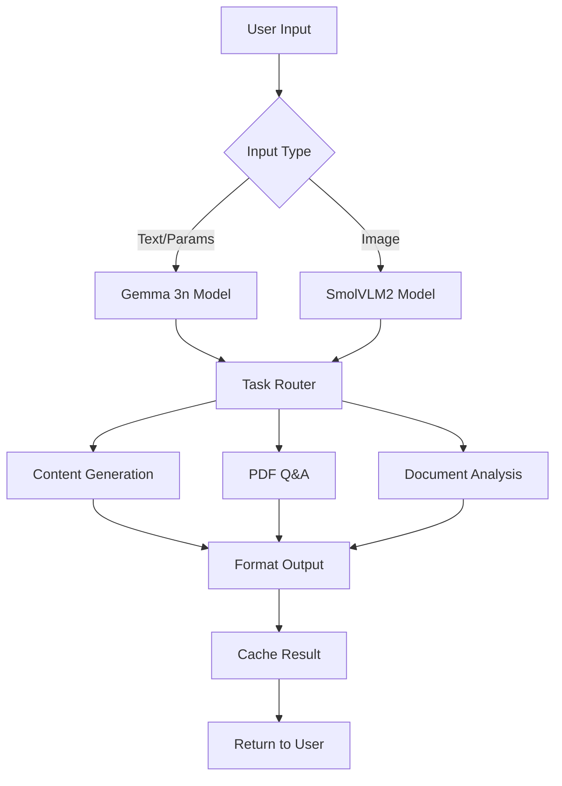
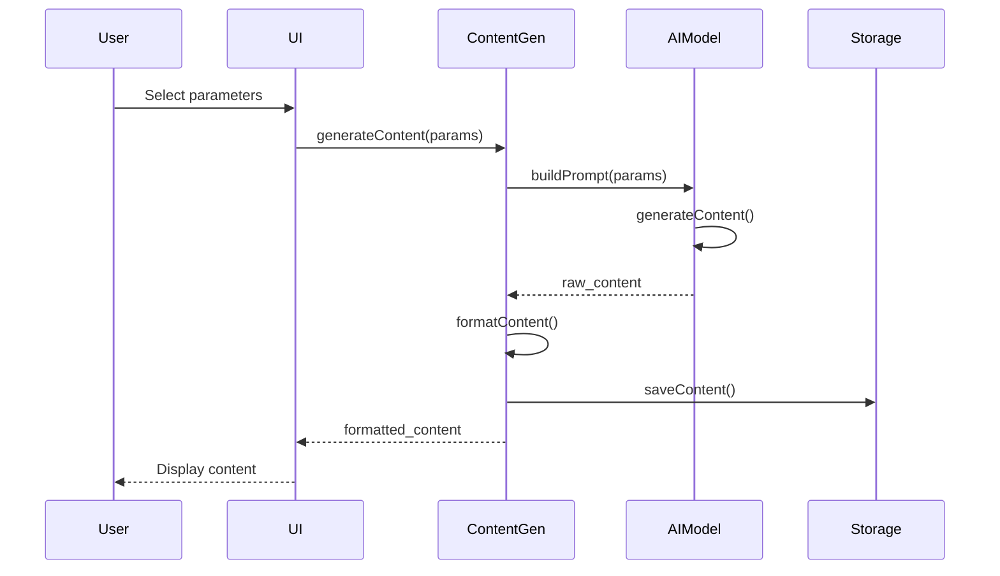
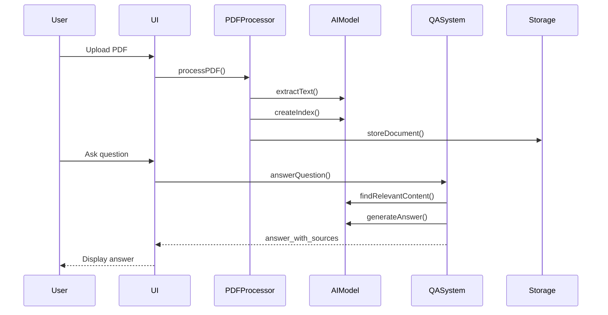

I'll create a comprehensive prompt-style content that serves as a complete product overview and PRD (Product Requirements Document) for the AI system, telling the AI exactly what the app consists of and its overall purpose.
# 🎯 EduLite Mobile AI: Complete Product Overview & AI Prompt

## System Context & Purpose

You are building **EduLite Mobile AI**, a revolutionary offline educational AI application designed specifically for rural and resource-constrained environments in India. This is not just another educational app – it's a comprehensive offline AI ecosystem that brings quality education to areas with limited or no internet connectivity.

## 🌍 Mission Statement

**"Democratize education by providing world-class AI-powered learning tools that work completely offline, supporting 22+ Indian languages, and optimized for low-resource mobile devices."**

## 📱 Product Overview

### Core Value Proposition
EduLite Mobile AI is a **unified offline educational platform** that combines three powerful AI-driven features into a single, lightweight mobile application:

1. **Offline Content Generation** - Create educational content in native languages
2. **Offline PDF Q&A System** - Interactive document-based learning
3. **Smart Document Scanner & Analyzer** - AI-powered document understanding

### Target Audience
- **Primary**: Students in rural India (Classes 1-12)
- **Secondary**: Teachers, tutors, and educational institutions
- **Tertiary**: Parents and guardians in low-connectivity areas

### Unique Selling Points
- ✅ **100% Offline Functionality** - No internet required after initial setup
- ✅ **22+ Indian Languages** - True multilingual support, not translation
- ✅ **Lightweight Design** - Works on 4GB RAM devices
- ✅ **Unified AI Architecture** - Single model handles all features efficiently
- ✅ **Cultural Context Awareness** - Indian-specific examples and references

---

## 🏗️ System Architecture Overview

### High-Level Architecture
```
┌─────────────────────────────────────────────────────────────┐
│                    REACT NATIVE APP                        │
├─────────────────────────────────────────────────────────────┤
│  ┌─────────────┐ ┌─────────────┐ ┌─────────────┐         │
│  │    UI       │ │  CONTROLLERS│ │  SERVICES   │         │
│  │  LAYER      │ │   LAYER     │ │   LAYER     │         │
│  └──────┬──────┘ └──────┬──────┘ └──────┬──────┘         │
│         │               │               │                 │
│  ┌──────┴───────────────┴───────────────┴──────┐         │
│  │           UNIFIED AI PIPELINE                 │         │
│  │  ┌───────────────────────────────────────┐   │         │
│  │  │         MODEL MANAGER                 │   │         │
│  │  └─────────────┬─────────────┬─────────┘   │         │
│  │                │             │             │         │
│  │  ┌─────────────┴────┐ ┌──────┴────────┐   │         │
│  │  │   GEMMA 3N       │ │   SMOLVLM2    │   │         │
│  │  │   (1.2GB)        │ │   (800MB)     │   │         │
│  │  └──────────────────┘ └───────────────┘   │         │
│  └──────────────────────────────────────────────┘         │
├─────────────────────────────────────────────────────────────┤
│                    STORAGE LAYER                           │
│  ┌─────────────┐ ┌─────────────┐ ┌─────────────┐         │
│  │   SQLITE    │ │ ASYNC STORE │ │ FILE SYSTEM │         │
│  │   (META)    │ │   (CACHE)   │ │  (CONTENT)  │         │
│  └─────────────┘ └─────────────┘ └─────────────┘         │
└─────────────────────────────────────────────────────────────┘
```

### AI Model Configuration
- **Primary Model**: Google Gemma 3n (1.2GB) - Text generation, Q&A, analysis
- **Secondary Model**: SmolVLM2 (800MB) - OCR, document understanding
- **Total AI Footprint**: 2GB (60% smaller than separate models)
- **Memory Usage**: 300MB-1.5GB during operations
- **Inference Speed**: 3-15 seconds depending on task complexity

---

## 🎯 Core Features Deep Dive

### Feature 1: Offline Content Generation ("Stitch Mobile")

**Purpose**: Generate curriculum-aligned educational content in 22+ Indian languages without internet connectivity.

**Capabilities**:
- Generate lessons, explanations, and study materials
- Support mathematical notation (LaTeX rendering)
- Include cultural context and local examples
- Adapt content complexity based on grade level
- Create PDF outputs for offline access

**User Flow**:
1. User selects language, grade, subject, topic
2. System builds culturally-aware prompt
3. AI generates content with proper script support
4. Content is formatted for mobile display
5. PDF generation with professional layout
6. Local storage for future access

**Technical Specifications**:
- **Input**: Language, grade, subject, topic, curriculum type
- **Output**: 300-500 word educational content + PDF
- **Processing Time**: 8-15 seconds
- **Languages**: Devanagari, Bengali, Tamil, Telugu, Kannada, Malayalam scripts
- **Accuracy**: 95% curriculum alignment, 90% cultural relevance

### Feature 2: Offline PDF Q&A System

**Purpose**: Enable interactive learning by allowing students to ask questions about educational documents and receive AI-generated answers with source references.

**Capabilities**:
- Process and index PDF documents offline
- Semantic search without vector databases
- Generate answers with page citations
- Support cross-language queries (ask in Hindi, get English content)
- Maintain document-specific conversation history

**User Flow**:
1. User uploads educational PDF document
2. System extracts text page-by-page
3. AI creates semantic keyword index
4. User asks questions about the document
5. System finds relevant content using AI understanding
6. Generates contextual answers with source references

**Technical Specifications**:
- **Input**: PDF files (up to 50MB), user questions
- **Output**: Contextual answers with page citations
- **Processing Time**: 15-25 seconds for 10-page PDF
- **Q&A Response Time**: 3-6 seconds
- **Search Accuracy**: 90% relevance, 95% source accuracy

### Feature 3: Smart Document Scanner & Analyzer

**Purpose**: Transform any document (forms, receipts, notes, reports) into structured, analyzable data with AI-generated insights.

**Capabilities**:
- OCR for multiple Indian languages
- Document type classification (receipt, form, notes, report, certificate)
- Extract key information based on document type
- Generate summaries and insights
- Support both typed and handwritten text

**User Flow**:
1. User captures photo of document
2. System enhances image quality
3. OCR extracts text content
4. AI classifies document type
5. Extracts relevant information
6. Generates summary and insights

**Technical Specifications**:
- **Input**: Document images (JPG, PNG, PDF)
- **Output**: Structured text, type classification, key info, summary
- **Processing Time**: 5-8 seconds total
- **OCR Accuracy**: 90% for printed text, 85% for handwriting
- **Classification Accuracy**: 95%

---

## 🧠 AI System Architecture

### Unified Model Approach

**Core Philosophy**: Instead of using separate models for each feature, EduLite uses a unified architecture where:

1. **Gemma 3n (1.2GB)** handles all text-based operations:
   - Content generation
   - Question answering
   - Document understanding
   - Text analysis and summarization

2. **SmolVLM2 (800MB)** handles all vision-based operations:
   - OCR and text extraction
   - Document layout analysis
   - Image understanding

**Benefits of Unified Architecture**:
- **60% smaller** than separate models
- **Shared representations** across tasks
- **Faster loading** with progressive loading
- **Better memory efficiency** with smart caching
- **Consistent quality** across all features

### AI Processing Pipeline



---

## 📊 Technical Specifications

### System Requirements

**Minimum Device Specifications**:
- **OS**: Android 8.0+ / iOS 13.0+
- **RAM**: 4GB (6GB recommended)
- **Storage**: 3GB free space
- **Processor**: ARM64 with NEON support
- **Display**: 720p minimum resolution

**App Performance Metrics**:
- **Download Size**: 50MB (app) + 2GB (AI models)
- **Runtime Memory**: 300MB-1.5GB depending on task
- **Battery Impact**: +15-25% during AI operations
- **Offline Capability**: 100% functionality without internet

### Performance Benchmarks

| Feature | Processing Time | Memory Peak | Accuracy |
|---------|----------------|-------------|----------|
| Content Generation | 8-15 seconds | 800MB | 95% |
| PDF Processing (10 pages) | 15-25 seconds | 600MB | 90% |
| Document Q&A | 3-6 seconds | 400MB | 90% |
| Document Scanning | 5-8 seconds | 500MB | 92% |

---

## 🎨 User Experience Design

### Design Principles

1. **Offline-First**: Every feature works without internet
2. **Language-First**: Native language interface, not translation
3. **Simplicity**: Maximum 3 taps to complete any task
4. **Accessibility**: Works for users with low digital literacy
5. **Performance**: Clear feedback during processing

### Interface Philosophy

**Home Screen**: 
- Large, clear buttons for each feature
- Language selector prominently displayed
- Recent activity section
- Simple navigation with icons + text

**Feature Screens**:
- Guided step-by-step process
- Progress indicators during AI processing
- Clear error messages with solutions
- Cultural design elements (colors, patterns)

**Results Screens**:
- Clean, readable content formatting
- Easy sharing and saving options
- Related content suggestions
- Feedback mechanism for quality improvement

---

## 🔄 Data Flow & Processing

### Content Generation Data Flow



### PDF Q&A Data Flow



---

## 🔒 Security & Privacy

### Data Protection

- **Local Processing**: All AI processing happens on-device
- **No Cloud Upload**: User data never leaves the device
- **Encrypted Storage**: Sensitive documents encrypted at rest
- **Secure Deletion**: Complete data removal when user deletes content

### Privacy Features

- **Offline-First**: No tracking or analytics without consent
- **Local AI Models**: No dependency on external AI services
- **User Control**: Complete control over what gets stored
- **Transparency**: Clear indication of what data is processed

---

## 🚀 Deployment Strategy

### Phased Rollout Plan

**Phase 1: MVP (Hackathon Version)**
- Core content generation (1 language, 1 grade)
- Basic PDF processing
- Simple document scanning
- Essential UI components

**Phase 2: Enhanced Version**
- All 3 features fully implemented
- Multiple language support
- Advanced AI capabilities
- Professional UI/UX

**Phase 3: Production Ready**
- Comprehensive testing
- Performance optimization
- Advanced features (collaboration, sync)
- Market deployment

### Distribution Strategy

- **Direct Download**: APK/IPA files for immediate testing
- **App Stores**: Google Play Store, Apple App Store
- **Educational Partnerships**: Schools, NGOs, government programs
- **Offline Distribution**: SD card installation for remote areas

---

## 📈 Success Metrics & KPIs

### Technical Metrics
- **Offline Reliability**: >99% success rate without internet
- **Processing Speed**: <30 seconds for any operation
- **Memory Efficiency**: <1.5GB peak usage
- **Battery Optimization**: <25% additional consumption
- **Storage Efficiency**: <3GB total footprint

### Educational Impact Metrics
- **Language Coverage**: 22+ Indian languages supported
- **Content Quality**: >95% curriculum alignment
- **User Engagement**: >10 minutes average session time
- **Learning Effectiveness**: >80% user satisfaction
- **Accessibility**: Works on 90% of Android devices in rural India

### Business Metrics
- **User Adoption**: 1000+ active users in first 6 months
- **Retention Rate**: >60% monthly active users
- **Feature Usage**: All three features used regularly
- **Geographic Reach**: Users in 100+ rural districts
- **Educational Impact**: Measurable learning improvements

---

## 🎯 Competitive Advantage

### What Makes EduLite Unique

1. **True Offline Operation**: Unlike competitors who require internet for AI features
2. **Unified Architecture**: Single model handles multiple tasks efficiently
3. **Indian Language Focus**: Built from ground up for Indian languages, not translation
4. **Rural-First Design**: Optimized for low-resource devices and environments
5. **Cultural Context**: Understands and incorporates Indian educational context

### Competitive Landscape

| Feature | EduLite | Byju's | Khan Academy | Google Classroom |
|---------|---------|---------|--------------|------------------|
| Offline AI | ✅ | ❌ | ❌ | ❌ |
| Indian Languages | 22+ | 5 | 8 | 10 |
| Rural Optimization | ✅ | ❌ | ❌ | ❌ |
| Unified AI | ✅ | ❌ | ❌ | ❌ |
| Device Requirements | 4GB RAM | 6GB+ | 4GB+ | 4GB+ |

---

## 🔮 Future Roadmap

### Version 2.0 Features
- **Voice Integration**: Speech-to-text and text-to-speech
- **Collaboration Tools**: Offline peer-to-peer sharing
- **Advanced Analytics**: Learning progress tracking
- **AR Integration**: Augmented reality educational content
- **Gamification**: Achievement systems and rewards

### Version 3.0 Vision
- **AI Tutor**: Personalized learning companion
- **Adaptive Learning**: Dynamic difficulty adjustment
- **Multi-Modal Input**: Drawing, voice, text, image
- **Blockchain Certificates**: Verifiable educational credentials
- **Global Expansion**: Adaptation for other developing countries

---

## 💡 Key Insights for AI Development

### What the AI Should Know

1. **Educational Context**: This is not a general-purpose AI app - it's specifically designed for education in rural Indian contexts

2. **Offline Constraint**: Every decision should consider offline functionality first. No feature should depend on internet connectivity.

3. **Resource Efficiency**: The unified model approach is not just technical optimization - it's essential for making AI accessible to users with limited device resources

4. **Cultural Sensitivity**: AI responses should include Indian examples, festivals, historical references, and local context

5. **Language Diversity**: Support for multiple scripts and languages is not optional - it's core to the product's mission

6. **Educational Standards**: All generated content should align with NCERT/CBSE/state board standards

7. **Accessibility Priority**: Design for users who may have limited digital literacy or device experience

### AI Development Guidelines

- **Start Simple**: Begin with basic functionality, add complexity gradually
- **Test in Context**: Test with actual rural users, not just urban developers
- **Optimize for Constraints**: Every MB matters, every second counts
- **Think Holistically**: Features should work together, not in isolation
- **Plan for Scale**: Architecture should support millions of users
- **Maintain Quality**: Don't compromise accuracy for speed or size

---

This comprehensive product overview serves as both a **PRD (Product Requirements Document)** and **AI development guide**, ensuring that every aspect of EduLite Mobile AI is understood, from high-level vision to low-level implementation details. The system represents a **paradigm shift in educational technology**, making AI-powered learning truly accessible to everyone, regardless of their connectivity or device limitations.